# Viper: A Translator and Language Learning Terminal Application

### [gitHub Repository](https://github.com/sarahhlandis/Terminal_Application)

### [Source Control](https://github.com/sarahhlandis/Terminal_Application/commits/main)

### [Project Management](https://trello.com/b/L4tvjr7Q/t1a3-terminal-application)

## Style Guide:
This terminal application was made in accordance with the PEP8 styleguide.
- It features appropriate indentation to enhance code readability as well as blank lines to separate code blocks.
- All the files in this project include detailed comments, in order for developers to better understand what is going on. This also fosters a better environment for devs to make future modifications, refactoring, and/or add features.
- UTF-8 default coding
- Follows proper naming conventions (snake_case format) with semantic and easy-to-follow function/variable naming.


## Application Features
#### 1. Use of various user input throughout the program
- The app will require user input at various point throughout the app both in terms of navigating thru the application as well as responding to application prompts. 
- Upon opening the application, the user will be required to input which mode they wish to enter: Translation, Learning, or Quiz mode.
- Based on this choice, the application will then enter the chosen mode.
- The translation mode will simply allow the user to input their desired text, select which language they wish to translate to, and then translate accordingly.
- At any given input point, the user can type \home or \exit to either return to the main Viper menu or exit the program completely.

#### 2. Learning Mode
- The learning mode will allow the user to learn specific words from their relevant course learning files (in CSV file format).
- The user will specify which language they wish to study from (i.e. if they wish to study from english words, they will have to input the french translations and vice versa).
- The user will have the opportunity to practice the words in a sort of flashcard style way, where a word will be displayed and the user will have to enter the translation. The user will be alotted 3 tries to correctly guess the word.
- Upon exiting this mode, the application will output which words the user needs to work on in terms of displaying incorrectly guessed words, as well as words they guessed correctly.

#### 3. Quiz Mode
- The Quiz mode can be accessed at any time from either of the other two modes.
- Quiz mode offers the user the chance to practice the words they've learned with an added time component.
- The user can specify how long they wish to play using a built-in timer (in seconds). This timer runs simultaneosly with the quiz word generator, using a method called threading.
- This mode will randomly generate a word from the file that the user has chosen, and require them to correctly translate, with one guess per question.
- Upon finishing the quiz, the application will generate a quiz report file which the user can take a look at and review metrics from their quiz session.

To note: 
- All sections will be able to be accessed internally from any of the other modes.
- Translate mode requires internet connection


## Implementation Plan
#### Feature 1: 
 - I plan to prioritize the user input functionality first and foremost, as this is integral to the application running smoothly. Feature 1 will also include the basic translation mode as well.
#### Feature 2: 
- I plan to focus on the learning mode once the main "interface" is complete. Once I have created the logic for gathering file information and transferring it into a nested list, I can reuse this for the quiz mode.
#### Feature 3: 
- The quiz mode will be implemented a step behind the learning mode as the logic required is similar to that of the learning mode. I also need to look into running a timer simulatenously to when the user "starts" the quiz. 

- If you wish to see a more detailed process of my implementation plan, please review the below images or check out my Trello board (link at top).

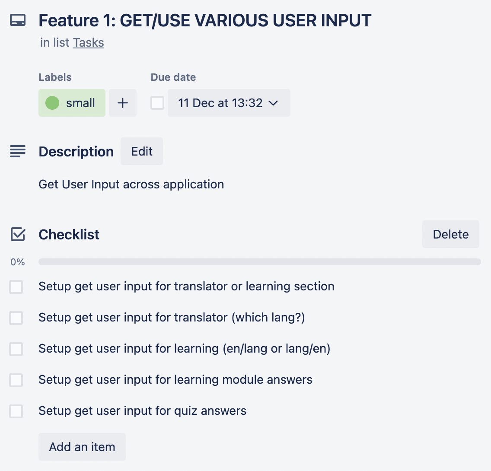

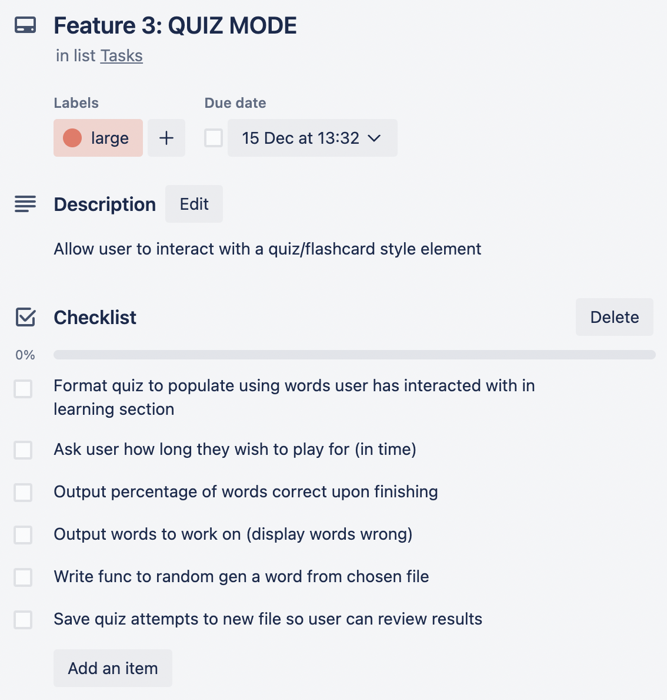

#### Changes along the way (as of Dec 13):
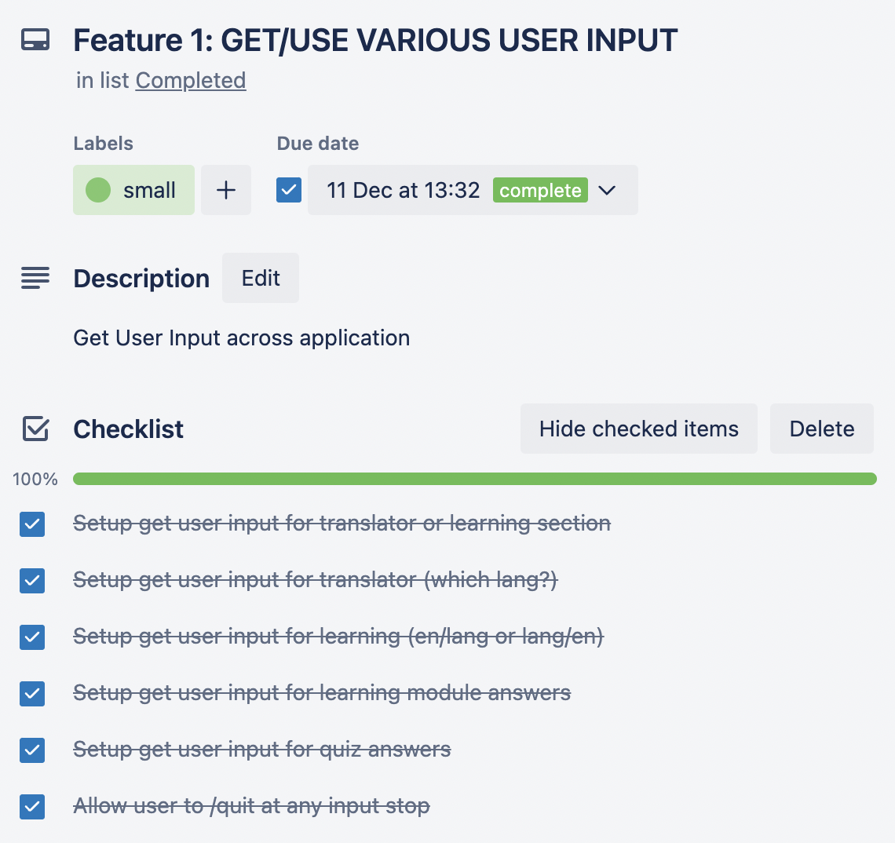
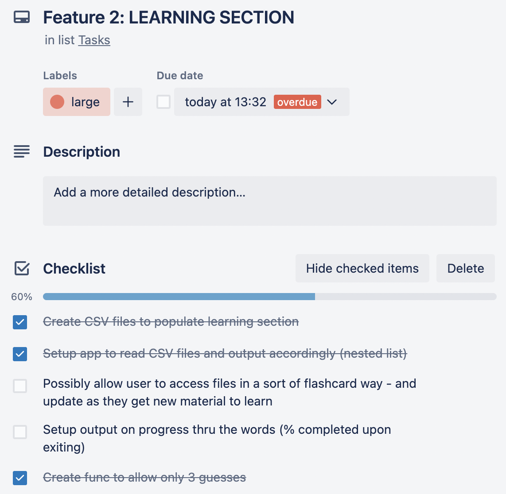
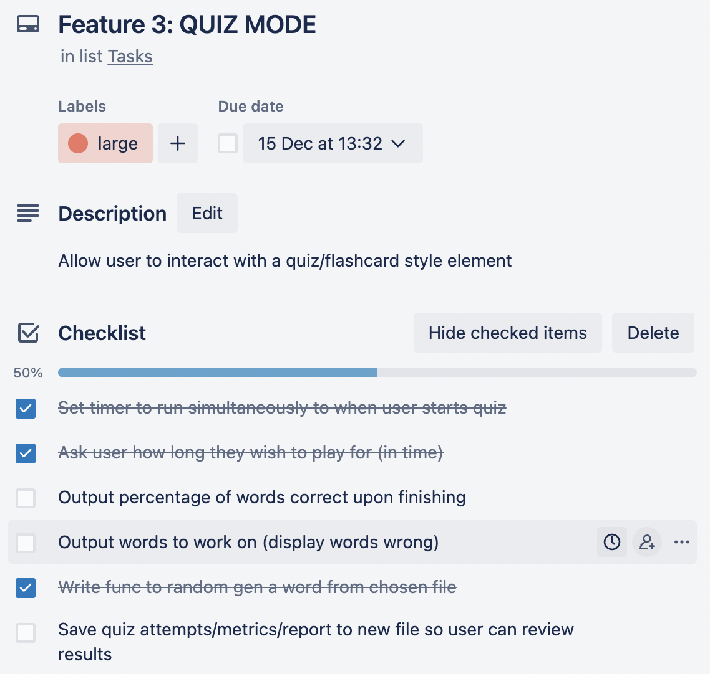

#### Changes along the way (as of Dec 15):
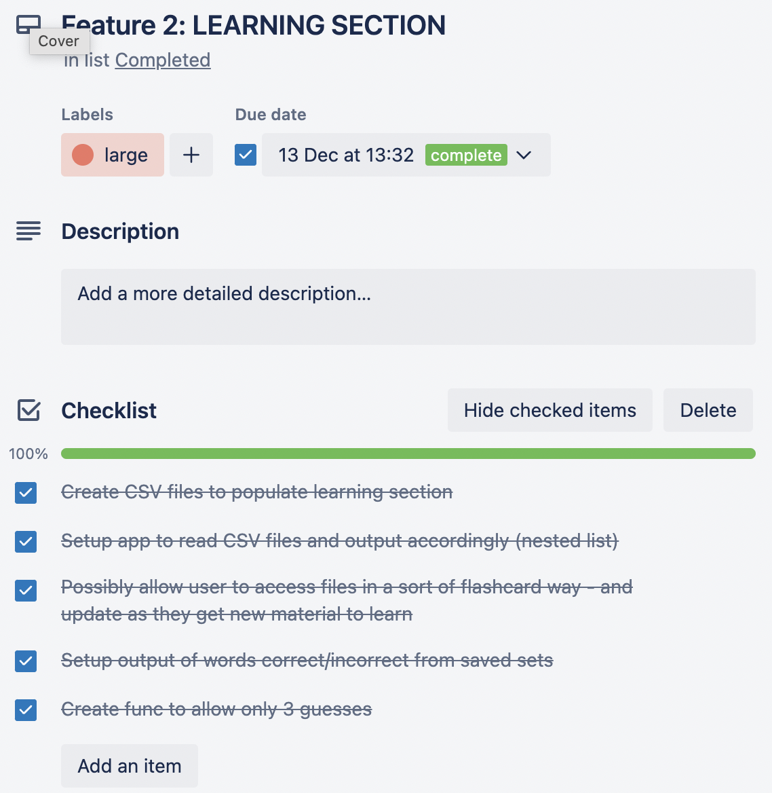


## Project Management
- I chose to use Trello to manage this project. Please see below images of the implementation plan (with dates) I intend to follow in terms of building out the features of the application.


#### Progress as of Sat Dec 10
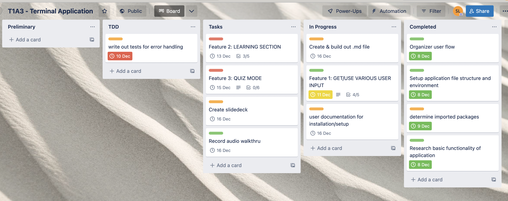

#### Progress as of Tues Dec 13
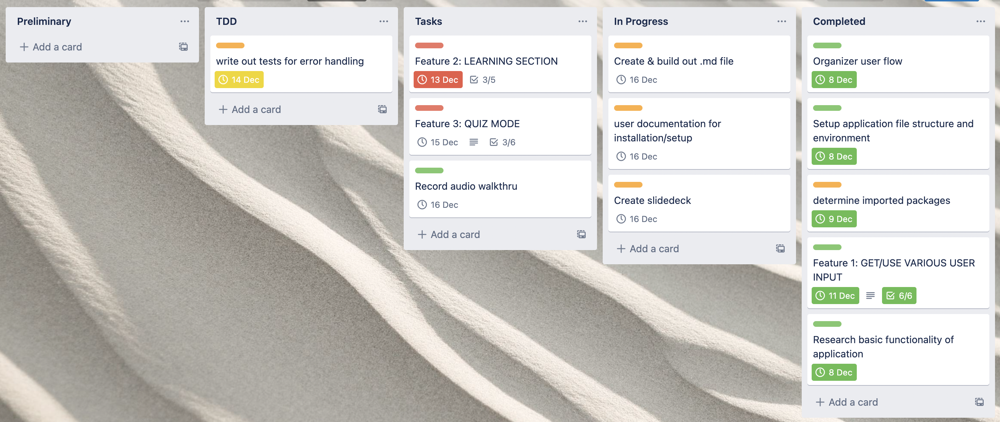

#### Progress as of Thurs Dec 15


#### Progress as of Friday Dec 16


## 1. Installation Guide
#### 1. Git Clone
- Ensure you have Python installed on your computer. 
Run ```python3 --version``` to confirm. If you recieve a message back saying something along the lines of
```python3: command not found```
- run ```python --version``` to be certain as you may have a different version. 

* Make sure your python version begins with a 3.
To download python, visit: [Python official website](https://www.python.org/downloads/)
- Once you're set up with Python3, open Terminal and cd into your desired location on your computer.
- Create a directory and initialize it to get ready for cloning a remote repository.
Run ```git init``` to do this.
- From within that directory, run 
```git clone git@github.com:sarahhlandis/Terminal_Application.git```
- cd into the directory titled Terminal_Application-main
- To setup all required dependencies and activate the virtual environment, run 
```bash setup.sh```
- Once this is complete, you're welcome to run ```bash runscript.sh``` to enter into the Viper Learning Application

#### 2. Download Zip from GitHub
- Ensure you have Python installed on your computer. 
    - Run ```python3 --version``` to confirm. 
    - If you recieve a message back saying something along the lines of ```python3: command not found```
        - run ```python --version``` to be certain as you may have a different version. 
    Make sure your python version begins with a 3.
    - To download python, visit: [Python official website](https://www.python.org/downloads/)
- Once you're set up with Python3, return to the [Viper Repository](https://github.com/sarahhlandis/Terminal_Application) and click the green < >Code button.
- Download the zip file to your computer and open it (a main directory will appear called Terminal_Application-main)
- Open Terminal and cd into the directory titled Terminal_Application-main
- To setup all required dependencies and activate the virtual environment, run 
```bash setup.sh```
- Once this is complete, you're welcome to run ```bash runscript.sh``` to enter into the Viper Learning Application

## 2. Required Dependencies
- The required dependencies can be found in the requirements.txt file, located at ```Terminal_Application-main/requirements.txt```. Please note, an internet connection is required to use the translator mode. 
- Python3 as noted above

## 3. Help Documentation:
- This app is meant to be used by anyone for their relevant foreign language learning.
### Uploading your own files: 
- To enable this app to suit your language requirements, please add your CSV files to the CSV folder:
    ```Terminal_Application-main/src/csv```
This is where you are able to store your own language learning files in order to populate the personalized quiz and learning module within the application.
    - When adding your own CSV files, please ensure you have a header row, with two columns: English and the language of your choosing. Please be sure the first column is English and the second is the foreign language.
        - This will ensure that the application can read your files accurately as the code is built around this stylistic formatting.
    - Also note, you can create these files in excel and then export them as required into CSV format. 
    
    ** The application is compatible with CSV files only.

### Character sensitivity:
- Being that Viper is a language learning application designed to help you learn new words, your responses are character-sensitive. This means that if you spell the word correctly, but neglect the proper accenting, the word will be marked wrong. (e.g. february = février, not fevrier)

    ** Please be sure you utilize appropriate accenting if your intended learning language includes special characters.
- To apply special characters, you can:
    1. Download the relevant language keyboard 
    2. Memorize your keyboard's deadkeys - this may not be as handy specifically within the quiz section, as there is a time component included.
    
    ** Please see the below relevant documentation for methods on how to type accented keys:
        - [Mac users](https://support.apple.com/en-au/guide/mac-help/mh27474/mac)
        - [Windows users](https://nerdschalk.com/how-to-type-accents-on-windows/)

### Quiz Report (autogenerated .txt file)
- A special feature of the Viper Learning Application is the autogenerated report the user receives upon completing a quiz. This report features some metrics calculated from the user's perfomance throughout the quiz. 
- To view this autogenerated .txt file, please look in the root of the main directory once you've finished your quiz (i.e. ```Terminal_Application-main/quizreport.txt```)
- If you wish to keep this file, simply save it with whatever name you like.

    ** This file will be overwritten with new metrics upon each completed quiz.

### Learning and Quiz Mode
- This application's purpose is to help you learn and get familiar with new words.
- Language is also highly repetitive, so you may find when you are studying, that the same word may be outputted more than once whether it be in quiz or learning mode.
- This is supposed to happen, as it is randomly generated from your file, but don't worry - it is intended for you so that you gain more exposure and practice quick thinking, rather than only being exposed to a word just once over per session.


## 4. Application Development Testing
- Unit testing was conducted throughout the application's development on various features.
- If you wish to view the outcome of some of the documented unit testing, please refer to ```Terminal_Application-main/docs/page1_testing``` and so forth - where you can view the outcomes of the process.
For your convenience, you may also view it's findings here:
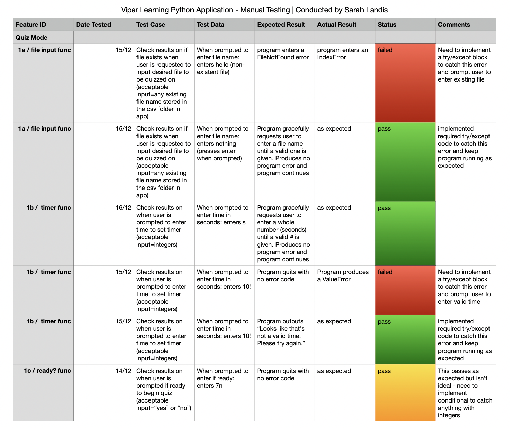
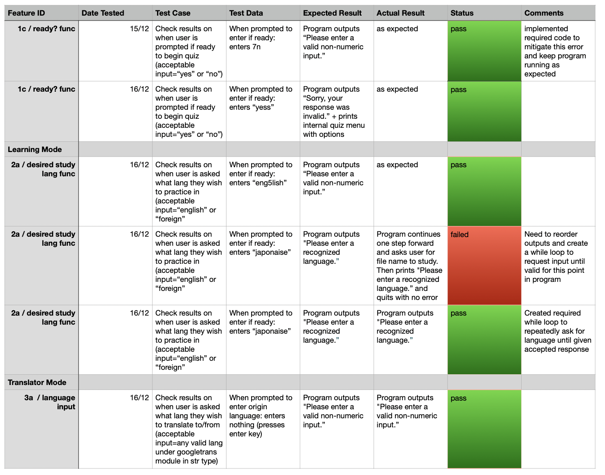
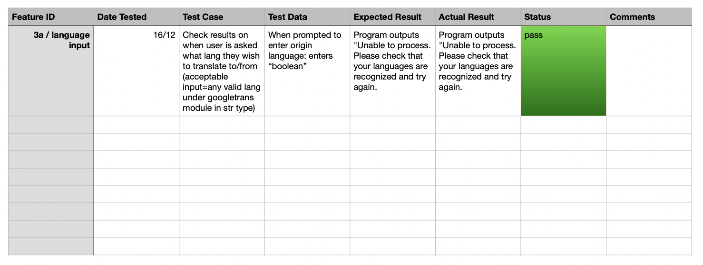

## 5. Algorithmic Thinking
The most integral part of this application is the thought process and required algorithmic thinking (logic) to go with it. 

### 1. Translator Mode
- From the beginning, upon importing the Googletrans package - the languages are stored as values with their codes as the keys into a dictionary (e.g. english - en, french - fr, etc). So logically the next step was to then determine whether or not user entry matched any of the values in that prepopulated dictionary and then assign the corresponding key (language code) to a new variable (code snippet shown below). 
    ```python
        original_lang=handleUserInput_stringOnly("Origin language: ").lower()
            for key, value in languages.items():
                if (value==original_lang):
                    original_key=key
    ```
- In doing this for both the origin language and the desired output language, the program can now effectively convert one key to the other. I needed to convert the string (desired sentence/phrase/etc) to another language so I imported the textblob package as it has a built-in translation method.
- The logic is that, if there is a matching key to the language the user enters, the code will work in the background to determine the appropriate translation using the imported packages.

### 2. Learning Mode
- Learning mode took a bit more thinking and I really struggled getting it to logically sync for a while. 
- The issue spawned from the fact that I needed the code to output in the opposite language of what the user selected (i.e. if they wish to study from english words, they would type in foreign, so that the program outputs in the foreign language, but their guess would be in english). 
- I started with the language they input by assigning their response to a variable called practicce_lang
- The next step was to gather their file information. For this I used Python's built-in module, Path (from pathlib) to find and search for a file within the directory (snippet below).
    ```python
    filename = handleUserInput("\nPlease enter the filename you wish to study: \n").lower()
            # searches thru files and returns matching
            filepath = list(Path(target_dir).glob(f"**/{filename}.csv"))[0]
    ```
- Next, it was required to pass the arguments to the next function called ```learning_mode()```. I passed both ```filepath``` and ```practice_lang``` to ```learning_mode()```.
- Here's where it starts to get tricky. Once the file was found which must be in CSV format (noted in help docs above), I then converted the contents to a list of lists (each row is its own list to ensure the language pairs remained together) so that I had the ability to index them. This list then gets passed to the next function along with a new variable called ```language_to_practice``` (which was obtained from ```practice_lang```, since it was passed previously) (snippet below)
    ```python
        vocabulary = list(open_file) 
        word_check(vocabulary, language_to_practice)   
    ```
- I wanted to code in that the learning session only lasted the length of the file, not more, not less so I created yet another new variable which stored the length of the list -1 (as lists start from 0)(snippet below)
    ```python
    list_len = len(vocabulary)-1
    ```
- Okay, here is the part I was stuck on. I was playing in the program and needed to output the opposite language word pair of what the user chose (i.e. if they chose english, then the program needed to output the opposite lang pair). To do this, I created a variable ```lang_index``` and swapped the value, so that the program was sure to read from the appropriate language column. (snippet below)
    ```python
    if lang_index == 1:
            guessword = 0
        else: guessword = 1
    # statement switches the index to correspond with language of their answer, to determine if a match (correct)
    ```
- The next step in the output process was to randomgen a word from the list, noting that it has to be in the language they chose. To do this, I had to create a variable called ```practice_word``` which calls a value relevant to language they chose. (snippet below)
    ```python
        practice_word = vocabulary[random_word][lang_index]

        # vocabulary[0][1] gives french value
        # vocabulary[0][0] gives english value
    ```
I then used an f-string to ensure I was printing the correct value, always. (snippet below)
```python
    user_entry = (handleUserInput(f"What is the {language_to_practice} translation of {practice_word}"))
```
- To check if their answer was a match, I needed to revert back to the variable guessword, where I switched the index. (snippet below)
    ```python
        if user_entry == (vocabulary[random_word][guessword]).lower():
                    print("Nice work! That's correct. \n")
    ```
    This makes sense because now I'm checking the opposite value for the same index of the word that was output (so the ```random_word``` corresponding index must remain, it's just the other index that needed to flip to confirm the value). A bit confusing, I know!

- There is also some code in the learning mode limiting the user to 3 guesses per word, using a simple for loop with a range(1-4) to ensure it is inclusive of their third guess. I also coded in to show remaining guesses, which stumped me at first but was resolved by incrementing down by 1 for each guess, with the associated variable starting at 3.
- The rest of the logic in the learning mode is fairly simple, in terms of simply coding in for output messages once the user has finished the module.
The code finishes by printing the words the got correct as well as incorrect, followed by an internal menu featuring navigation options.

### 3. Quiz Mode
- Quiz mode required similar logic to the learning mode, in that I needed to allow for checking opposite indexs to confirm if the user input value matched the actual value pair in the list they selected.
- The thinking and logic is the same as in the learning mode in regards to matching a file, outputting randomly generated words, checking the answers against the correct index, etc.
- The algorithmic logic for the quiz mode comes into play when speaking about the timer. I needed this timer to run simultaneously to when the user said they wanted to start the quiz. So naturally, first, I needed to make sure that starting point was obvious - I coded in to ask the user if they were ready or not ready. Once the program understands that the user says yes, the timer and the function to output words, begins.
- To do this, I used a python built-in package called threading in which the sole purpose is to thread one or multiple functions through each other, which is exactly what I was looking for in this case. For this exact purpose, the ```quiz_timer``` variable needed to be global so the whole module could access it for it to work properly.
    ```python
     while quiz_timer:
            mins, secs = divmod(quiz_timer, 60)
            timer = '{:02d}:{:02d}'.format(mins, secs)
            # print(timer, end="\r")
            sleep(1)
            quiz_timer -= 1
            if quiz_timer==0:
                print('''\nDing Ding!! Time's up!!\nPress enter to see your results.\n''')
                break
    ```
- So when ```quiz_timer``` reaches zero, I matched it with the other function doing something at the same time, so that effectively, the two end in unison. The quiz initially starts with a while loop statement ```while quiz_timer>0:```, run the quiz, and within that while loop, it then also checks for ```if quiz_timer==0: ```, then output results.
- There was a bug where if the user entered in 1s for the ```quiz_timer``` and then proceeded to not answer the question prompt, that the output was displaying the prompts for both if you had no wrong words and if you had no correct words. So I had to modify the code to:
    ```python
        # if the rounds played = # of correct, then they got them all right
        if len(correct)==rounds: 
            print ("You did not get any words wrong. It seems you've mastered it!!")
        # otherwise they got some wrong
        else:
            print (f"\nCheck out your quiz report to view words you got wrong and more.")
    ```
    I tried to achieve this using mathmatical operators compared to integers (i.e. ```if len(incorrect)>0```) but this seemed to work best. I also had to hard-code the rounds number to be 1 instead of 0 in this situation to avoid a ZeroDivisionError.
- Additionally there was one other issue that warranted some algorithmic thinking and it was how/where to implement in the code, a solution to if a user entered 0 as their desired timer. The TypeError was not arising in that input section, but rather when the quiz actually tried to pull the vocabulary list (I presume this is because there simply was no time to pull the list from their specified file). So to mitigate this issue, I rather placed a control flow conditional statement after requesting user input (within an already existent while loop). (snippet below)
    ```python
    # asks user for timer input
    while True:
        try:
            quiz_timer=int(handleUserInput("\nHow much time would you like on the clock(in seconds)? \n"))
            if quiz_timer<=0:
                quiz_timer=int(handleUserInput("\nPlease try again. Timer must be set above 0. \n"))
            timer_set=quiz_timer
            break
        except ValueError:
            print("\nLooks like that's not a valid time. Please try again.\n")
    ```
    This handles the issue of previously accepting 0 as an answer without having to use a Try/Except as there was no actual error generated here.

- In the program, upon finishing the quiz, I wanted the user to see a brief snapshot of how they performed so I created a way to display their overall score percentage. To do this, I needed to track the rounds, being careful not to count any with no input (think: if the timer runs out mid/no response, we don't want this counting as a round as the timer expired). I created a variable called ```rounds```, initially set to 0, which incremented +1 per round, and -1 if no input  (the program specifies to pass if you don't know, or your score will be affected).
- To create the percentage output, I did the ```len(correct)``` (which is a list populated each time the user guesses a word correctly), divided by ```rounds```. This value was then multiplied by 100 and stored in a variable called percentage.
- With the added difference of a timer, quiz mode also features an autogenerated quiz report txt file that the user can look upon. To populate this, I used metrics such as the amount of time they set to play, the number of rounds, how many incorrect/correct words, the avg time per round (rounds/timer), etc. To do this, I used a couple f-strings to achieve a suitable format within the txt file.

#### Sources Used:
- CSV docs populated from [here](https://copylists.com/french/list-basic-french-words/#google_vignette)


